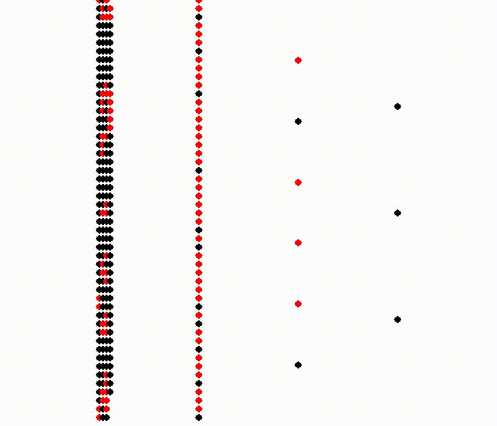
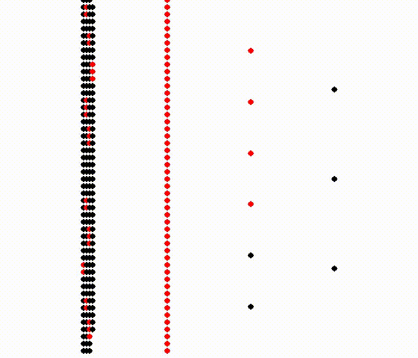
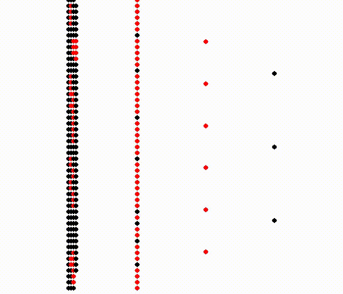

# Spiking MoYF

This is a Spiking Neural Network library based on a below paper.

[Training Deep Spiking Neural Networks Using Backpropagation](https://www.frontiersin.org/articles/10.3389/fnins.2016.00508/full)

## Examples

```sh
$ python examples/digits.py
MNIST Loading...OK

...

In 5938
answer:
[[ 1.  1.  1.  1.  1.  0.  0.  0.  0.  0.  0.  0.  0.  0.  0.]
 [ 0.  0.  0.  0.  0.  1.  1.  1.  1.  1.  0.  0.  0.  0.  0.]
 [ 0.  0.  0.  0.  0.  0.  0.  0.  0.  0.  1.  1.  1.  1.  1.]]
infer:
[[ 1.  1.  1.  1.  1.  0.  0.  0.  0.  0.  0.  0.  0.  0.  0.]
 [ 0.  0.  0.  0.  0.  1.  1.  1.  1.  1.  0.  0.  0.  0.  0.]
 [ 0.  0.  0.  0.  0.  0.  0.  0.  0.  0.  1.  1.  1.  1.  1.]]
Complete!
Saving...OK
```

This model is saved in `./models/`.

If you want to use already trained this model, use below.

```sh
$ python examples/digits.py --load sample_models/0-2.npz --no-save
MNIST Loading...OK
Loading...OK
No spike... in [False False False False False False False False False False False False
 False False False]
In 0
answer:
[[ 1.  1.  1.  1.  1.  0.  0.  0.  0.  0.  0.  0.  0.  0.  0.]
 [ 0.  0.  0.  0.  0.  1.  1.  1.  1.  1.  0.  0.  0.  0.  0.]
 [ 0.  0.  0.  0.  0.  0.  0.  0.  0.  0.  1.  1.  1.  1.  1.]]
infer:
[[ 1.  1.  1.  1.  1.  0.  0.  0.  0.  0.  0.  0.  0.  0.  0.]
 [ 0.  0.  0.  0.  0.  1.  1.  1.  1.  1.  0.  0.  0.  0.  0.]
 [ 0.  0.  0.  0.  0.  0.  0.  0.  0.  0.  1.  1.  1.  1.  1.]]
Complete!
```

You can also visualize these spikes. Use below.

```sh
$ python examples/digits.py --load sample_models/0-2.npz --no-save --draw
```

This visualizes this network distinguishes among 0, 1 and 2.






## Requirements

* Python 3
* NumPy
* scikit-learn

## License

MIT License
